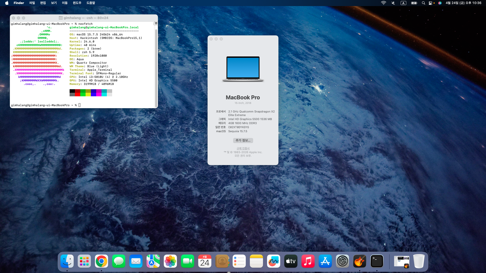

# HP-Pavilion-15-p238TU-OpenCore
Hackintosh for HP Pavilion 

|Specifications|Details|
|------|---|
|CPU|Intel Core i3-5010U (Broadwell-U) |
|Graphics|Intel HD Graphics 5500|
|Memory|DDR3-L SODIMM 1600Mhz 4GBx1 SKHynix|
|SATA SSD|GIGABYTE 240GB **(Does not come with laptop, Custom)**|
|Wireless|Intel® Wireless-AC 3160|
|Ethernet|Realtek RTL810x|
|Audio|Realtek ALC290|
|BIOS|InsydeH20 for HP|
